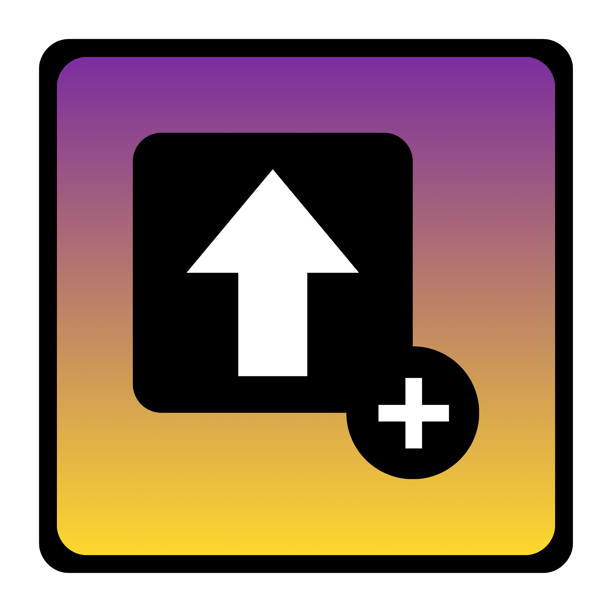

# CustomJump

CustomJump adds a configurable jump key for Geometry Dash.

## Features

- Adds a `Jump Key` setting (`keybind`) in Geode settings.
- Lets you assign any keyboard key as an extra jump input.
- Only runs during active gameplay (`PlayLayer`), not menus or editor.
- Keeps default jump keys active (`Space`, `W`, `Up Arrow`).

## Installation

1. Download the latest `.geode` package from Releases.
2. Install through Geode (drag-and-drop or Geode UI).
3. Open `CustomJump` settings and set your preferred `Jump Key`.

## Notes

- The custom jump key is additive. It does not disable vanilla jump keys.
- This mod alters gameplay input and may be considered 'cheating' in a way, so use it at your own risk and disable it if real gameplay matters.
